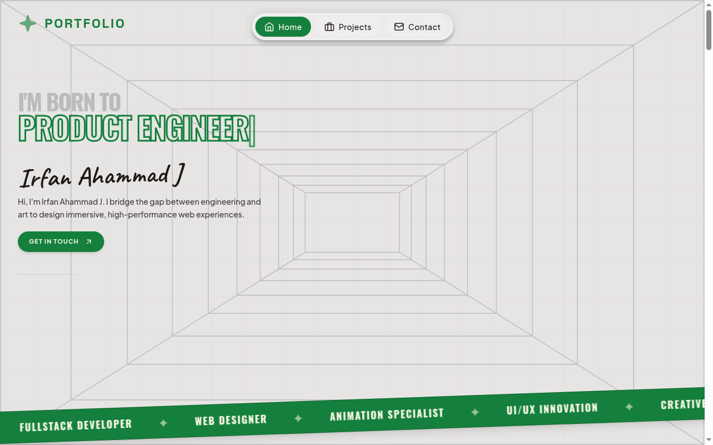
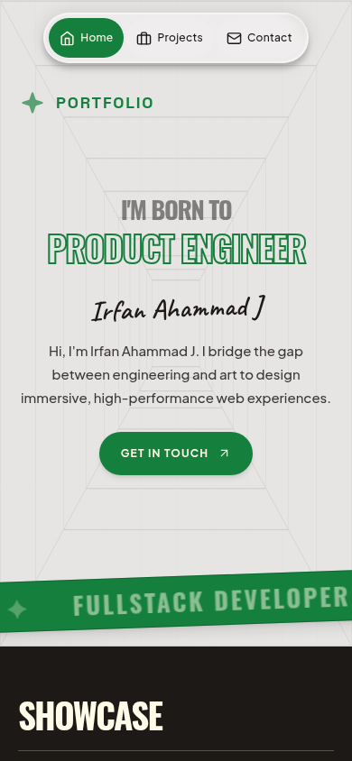

# Irfan Ahammad J - Portfolio

Personal portfolio of Irfan Ahammad J, a full-stack developer and AI/ML learner from Kerala, India.

**Live site:** https://irfan-portfolio-seven-delta.vercel.app/

## Screenshots

<p align="center">
  
  
</p>

## What is on the site

- Hero with a short introduction and a scrolling role banner
- Showcase of selected work
- Skills: JavaScript, TypeScript, Next.js, React, Python, Django, Flask, SQL, Supabase, Firebase, REST APIs, Scikit-learn, machine learning
- Projects: MakeMyCut, Fizz & Flame, an e-commerce store, Bizzag and BuildMyLogic (Learning Impact Award, AI Conclave 2026 hackathon), each with a live link
- Internship experience and achievements
- Contact section

## Built with

A single static `index.html` with embedded styles and scripts, deployed on Vercel. The layout adapts to phones, with a compact hero, labelled navigation and touch-friendly cards.

## Run locally

```sh
git clone https://github.com/irfanahmed0019/irfan-portfolio.git
cd irfan-portfolio
npx serve .
```

Then open the address it prints.

## Contact

GitHub: [@irfanahmed0019](https://github.com/irfanahmed0019) - LinkedIn: [irfan-ahammad-j](https://www.linkedin.com/in/irfan-ahammad-j)
